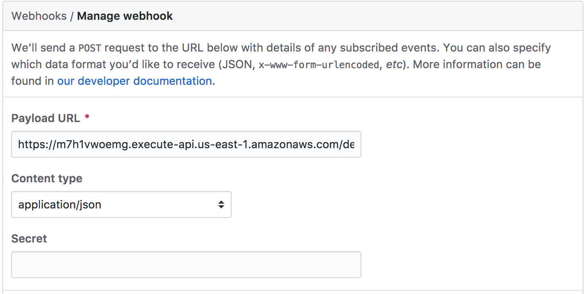

# awesome-codepipeline

After several talks [at work](http://costadigital.io/) about the feasibility of using [AWS Codebuild](https://aws.amazon.com/codebuild/) and [AWS Codepipeline](https://aws.amazon.com/codepipeline/) to verify the integrity of our codebase, I decided to give it a try. 

We use pull-requests and branching extensively, so one requirement is that we can dynamically pickup branches other than the master branch. 
AWS Codepipeline only works on a single branch out of the box, so I decided to use [Githubs webhooks](https://developer.github.com/webhooks/), [AWS APIGateway](https://aws.amazon.com/api-gateway/) and [AWS Lambda](https://aws.amazon.com/lambda/) to dynamically support multiple branches:

We're creating a webhook that fires whenever our repository has a pull request opened or closed. Our handler for this event will clone a AWS CodePipeline to watch for changes to that pull requests's branch.

Github has a very mature [webhook integration](https://developer.github.com/webhooks/) where you can be notified of a wide range of events. You can run a linter when a pull request is opened, send a notification when an issue is created, or trigger a deploy when a pull request is merged.

## Architecture

First, you create a master AWS CodePipeline, which will serve as a template for all non-master branches.  
Next, you setup an AWS APIGateway & an AWS Lambda function which can create and delete AWS CodePipelines based off of the master pipeline.  
Lastly, you wire github webhooks to the AWS APIGateway, so that opening a pull request duplicates the master AWS CodePipeline, and closing the pull request deletes it again.


## Details

### AWS Lambda

For the AWS Lambda function I decided to use [golang](https://golang.org/). 
The implementation relies on the AWS go sdk to manage the CodePipeline. 

### AWS APIGateway

The APIGateway is managed via cloudformation (via Serverless Framework) or terraform, and it consists of a single API, where the root resource is wired up to handle webhooks. Github specific headers are transformed so they are accessible in the backend.

### AWS CodePipeline

The CodePipeline serving as template is configured to run on master. This way all merged pull requests trigger tests on this pipeline, and every pull request itself runs on a separate AWS CodePipeline.  
This is great because every PR can be checked in parallel.

### AWS CodeBuild 

In my example the AWS CodeBuild configuration is static. However one could easily make this dynamic, e.g. by placing AWS CodeBuild configuration files inside the repository. This way the PRs could actually test different build configurations.


## Outcome

The approach outlined above works very well. It is reasonable fast and technically brings 100% utilization with it. And it brings great extensibility options to the table: one could easily use this approach to spin up entire per PR environments, and tear them down dynamically.  
In the future I'm looking forward to working more with this approach, and maybe also abstracting it further for increased reusability.

### How could anyone else have made this project from scratch?

```
export APPNAME="pullrequest-clone-pipeline"
mkdir -p $GOPATH/src/github.com/$GITHUB_USER/$APPNAME
cd $GOPATH/src/github.com/$GITHUB_USER/$APPNAME
cd $APPNAME
echo "10.8.0" > .nvmrc
nvm install
npm init -f
npm install serverless --save-dev
npm install serverless-pseudo-parameters --save-dev
npx serverless create -t aws-go-dep --name $APPNAME
```

### Getting Started

Use the AWS cli to add the parameters to SSM parameter store:

```
aws ssm put-parameter --name '/core/github-otp' --value "$GITHUB_OAUTH_TOKEN" --type SecureString --region us-east-1
aws ssm put-parameter --name '/core/github-pr-webhook-secret' --value "$(ruby -rsecurerandom -e 'puts SecureRandom.hex(20)')" --type SecureString --region us-east-1
```

**You will need Serverless framework version 1.22.0 or above.**

### Retrieve CloudFormation

```
aws cloudformation get-template --stack-name deploy-docker-sagoku-test
```

### Creating our Serverless webhook handler

In our handler, we want to parse the given event for the information we want, then send an AWS SDK request to clone the code pipeline and override some information.

We're going to be using the [`PullRequestEvent`](https://developer.github.com/v3/activity/events/types/#pullrequestevent) from Github to get notifications of our repository having a pull request opened or closed. We want to post a message that looks as follows:

Github includes an [example event structure](https://developer.github.com/v3/activity/events/types/#webhook-payload-example-25), which is very useful. A truncated version is below:

```json
{
  "action": "closed",
  "number": 1,
  "pull_request": {
    "url": "https://api.github.com/repos/Codertocat/Hello-World/pulls/1",
    "number": 1,
    "state": "closed",
    "head": {
      "label": "Codertocat:changes",
      "ref": "changes",
      "sha": "34c5c7793cb3b279e22454cb6750c80560547b3a",
      "repo": {
        "name": "Hello-World",
        "full_name": "Codertocat/Hello-World",
        "git_url": "git://github.com/Codertocat/Hello-World.git",
        "ssh_url": "git@github.com:Codertocat/Hello-World.git"
      }
    }
  },
  "repository": {
    "name": "Hello-World",
    "full_name": "Codertocat/Hello-World",
    "git_url": "git://github.com/Codertocat/Hello-World.git",
    "ssh_url": "git@github.com:Codertocat/Hello-World.git",
    "clone_url": "https://github.com/Codertocat/Hello-World.git",
    "svn_url": "https://github.com/Codertocat/Hello-World"
  }
}
```

Alter the handler so it will:
+ Handle receiving those github webhook events for both pull request creation and deletion (via API gateway).
+ Make an AWS SDK to delete old pipelines when the pull request is closed. 
+ Clone a template pipeline when the pull request is opened.

### Setting up your Github webhook

We're ready for the last step -- creating the Github webhook to send to our function endpoint.

Navigate to a repository where you're an owner or an admin. Click "Settings" at the top, then the "Webhooks" tab on the left hand side. Then, click the "Add webhook button":


In the Add webhook screen, enter your function endpoint into the Payload URL input box and choose `application/json` as the Content Type:



Then, go to the section to choose which events trigger the webhook. Click the "Let me select individual events" option.


Uncheck any other events and check the Pull Requests option


Click the "Add webhook" button, and you're ready to go! Github will immediately send a test event to your endpoint. There will be a section showing "Recent Deliveries" and the status code, so you can see if you're having any failures. If you are, check the logs in your console with `sls logs -f stargazer` to find the errors.

### Securing your github webhook
+ [See Securing your github webhook](https://developer.github.com/webhooks/securing/)

# References

+ [awesome-codepipeline](https://github.com/nicolai86/awesome-codepipeline-ci)
+ [Serverless Github Webhook Slack](https://serverless.com/blog/serverless-github-webhook-slack/)
